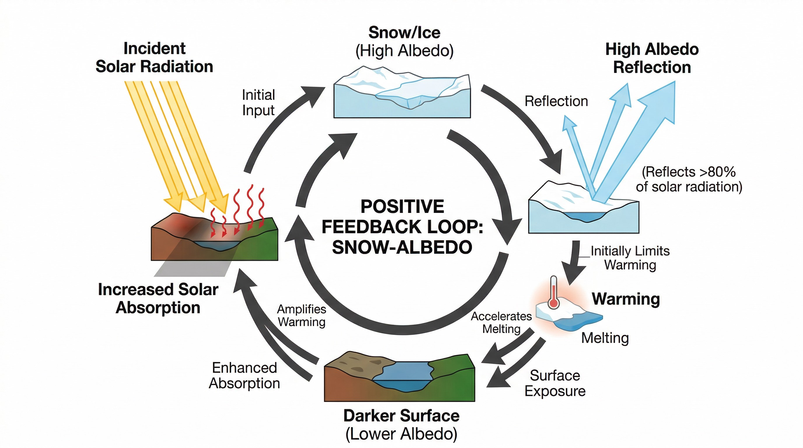
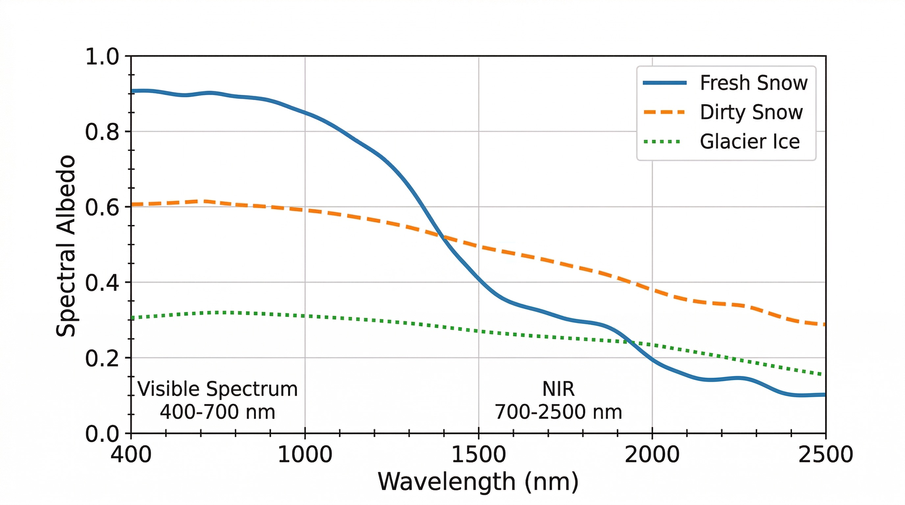
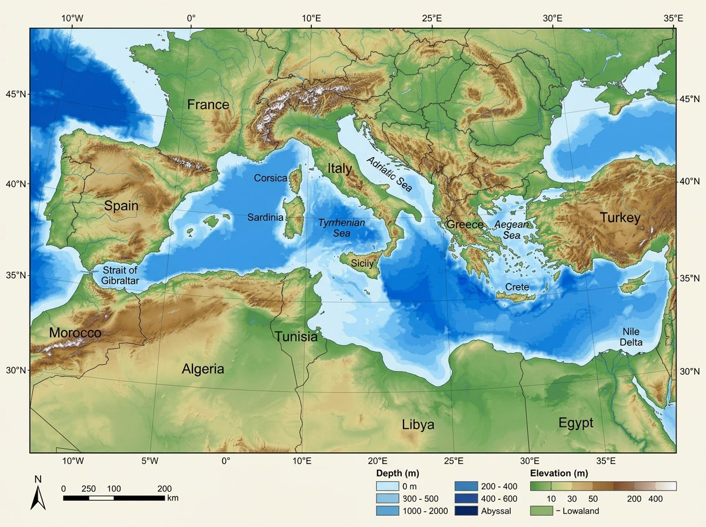

# MCP Image Scientific

[](LICENSE)
[](https://nodejs.org/)
[](https://modelcontextprotocol.io/)

**MCP server for publication-quality scientific figures** — diagrams, charts, and maps with structured prompts and strict editing. Powered by Gemini 2.0 Flash Image.

> Forked from [shinpr/mcp-image](https://github.com/shinpr/mcp-image), extended with scientific figure styles (`scientific_diagram`, `scientific_chart`, `scientific_map`), strict edit mode, and structured prompt pipelines for academic publishing.

---

## What Makes This Different

| Feature | Generic MCP Image | MCP Image Scientific |
|---------|-------------------|----------------------|
| **Figure styles** | None | `scientific_diagram`, `scientific_chart`, `scientific_map` |
| **Edit mode** | Creative only | `strict` — preserves everything except the requested change |
| **Prompt pipeline** | Basic enhancement | Structured prompts with domain-specific rules (axes, legends, scale bars) |
| **Target audience** | General | Researchers, students, academic publishing |

---

## Examples

All figures below were generated by this MCP server in a single prompt each.

### Scientific Diagram — Snow-Albedo Feedback Loop



```
figureStyle: "scientific_diagram"
prompt: "Diagram of the snow-albedo feedback loop: solar radiation,
         high albedo reflection, warming, snowmelt, darker surface,
         lower albedo, more absorption. Circular feedback with labeled arrows."
```

### Scientific Chart — Spectral Albedo Curves



```
figureStyle: "scientific_chart"
prompt: "Line chart: spectral albedo (y: 0-1) vs wavelength (x: 400-2500 nm)
         for fresh snow (~0.9), dirty snow (~0.6), glacier ice (~0.3).
         Curves decline in NIR. Axis labels, units, legend, grid."
```

### Scientific Map — Mediterranean Bathymetry



```
figureStyle: "scientific_map"
prompt: "Bathymetric and topographic map of the Mediterranean Sea.
         Ocean depth in shades of blue, land elevation green to brown to white.
         Label seas, straits, major islands. Lat/lon grid, scale bar, legend."
```

---

## Quick Start

### 1. Get a Gemini API Key

Get your free API key from [Google AI Studio](https://aistudio.google.com/apikey).

### 2. Add the MCP Server

**Claude Code** (recommended):

```bash
claude mcp add mcp-image \
  --env GEMINI_API_KEY=your-api-key \
  --env IMAGE_OUTPUT_DIR=/absolute/path/to/images \
  -- npx -y mcp-image-scientific
```

**Cursor** — add to `~/.cursor/mcp.json`:

```json
{
  "mcpServers": {
    "mcp-image": {
      "command": "npx",
      "args": ["-y", "mcp-image-scientific"],
      "env": {
        "GEMINI_API_KEY": "your-api-key",
        "IMAGE_OUTPUT_DIR": "/absolute/path/to/images"
      }
    }
  }
}
```

**Codex** — add to `~/.codex/config.toml`:

```toml
[mcp_servers.mcp-image]
command = "npx"
args = ["-y", "mcp-image-scientific"]

[mcp_servers.mcp-image.env]
GEMINI_API_KEY = "your-api-key"
IMAGE_OUTPUT_DIR = "/absolute/path/to/images"
```

### 3. Generate a Figure

Ask your AI assistant:

```
Generate a scientific diagram showing the carbon cycle
with labeled arrows between atmosphere, ocean, and land.
Use figureStyle: "scientific_diagram".
```

---

## API Reference

### `generate_image`

Single tool for all image operations. Two-stage process: prompt optimization (Gemini 2.0 Flash) then image generation (Gemini 2.0 Flash Image).

| Parameter | Type | Required | Description |
|-----------|------|----------|-------------|
| `prompt` | string | Yes | Text description or editing instruction |
| `figureStyle` | string | — | `scientific_diagram`, `scientific_chart`, or `scientific_map` |
| `editMode` | string | — | `strict` (preserves original) or `creative` (default) |
| `inputImagePath` | string | — | Absolute path to source image for editing |
| `aspectRatio` | string | — | `1:1`, `16:9`, `9:16`, `4:3`, `3:2`, `21:9`, etc. |
| `imageSize` | string | — | `2K` or `4K` for high-resolution output |
| `fileName` | string | — | Custom output filename |
| `blendImages` | boolean | — | Multi-image blending for composite scenes |
| `maintainCharacterConsistency` | boolean | — | Keep character appearance across generations |
| `useWorldKnowledge` | boolean | — | Real-world knowledge for landmarks, historical figures |
| `useGoogleSearch` | boolean | — | Google Search grounding for time-sensitive facts |
| `validateQa` | boolean | — | Run QA validation on this figure (requires `figureStyle`) |

### `figureStyle` Details

| Style | Auto-includes | Best for |
|-------|---------------|----------|
| `scientific_diagram` | Clean layout, labeled arrows, neutral background | Process flows, concept maps, feedback loops |
| `scientific_chart` | Axis labels with units, legend, grid lines | Line/bar charts, data visualizations |
| `scientific_map` | Scale bar, north arrow, legend, coordinates | Geographic/spatial figures |

### Strict Edit Mode

Use `editMode: "strict"` with `inputImagePath` to modify an existing figure while preserving all other elements:

```
prompt: "Change the 'fresh snow' line from blue to dark green"
editMode: "strict"
figureStyle: "scientific_chart"
inputImagePath: "/path/to/existing-chart.png"
```

---

## Environment Variables

| Variable | Required | Description |
|----------|----------|-------------|
| `GEMINI_API_KEY` | Yes | Google Gemini API key ([get one here](https://aistudio.google.com/apikey)) |
| `IMAGE_OUTPUT_DIR` | No | Absolute path for output images (default: `./output`) |
| `SKIP_PROMPT_ENHANCEMENT` | No | Set `true` to bypass prompt optimization |
| `SCIENTIFIC_QA_ENABLED` | No | Set `true` to enable post-generation QA validation (off by default) |
| `SCIENTIFIC_QA_MODEL` | No | Model for QA evaluation (default: `gemini-3.1-pro-preview`) |
| `SCIENTIFIC_QA_MAX_RETRIES` | No | Max retries on hard QA failures (default: `1`) |

---

## QA Validation

Post-generation quality assurance powered by Gemini 3.1 Pro. Evaluates scientific figures against style-specific criteria before delivery.

Two ways to enable:

1. **Per-request** — just ask: *"Generate a chart and validate it"* → the assistant passes `validateQa: true`
2. **Globally** — set `SCIENTIFIC_QA_ENABLED=true` to validate every scientific figure automatically

**Hard checks** (must pass — triggers automatic retry on failure):
- Spelling accuracy, text readability, clean background, sufficient contrast
- **Charts**: axis labels with units, legend, grid lines
- **Maps**: scale bar, north arrow, legend
- **Diagrams**: labeled arrows, logical flow

**Soft checks** (advisory — reported but does not block):
- Colorblind-friendly palette, balanced layout, title presence

On hard failure, the prompt is automatically patched and the figure regenerated (up to `SCIENTIFIC_QA_MAX_RETRIES` times).

---

## Attribution

This project is a fork of [shinpr/mcp-image](https://github.com/shinpr/mcp-image) by Shinsuke Kagawa. The original server provides general-purpose image generation via Gemini. This fork adds scientific figure styles, strict edit mode, and structured prompt pipelines for academic use.

## License

[MIT](LICENSE) — see LICENSE for full terms.
